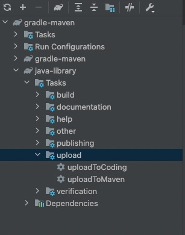

基于`Java`语言与`Gradle Api`开发的`Gradle Plugin`，本`Gradle插件`可以让你的`library`发布到`MavenCenter`和自己的`nexus`私服变得非常容易。
内置了阿里云`Maven`中央仓库，其中配置了`aliyun`代理的`central`、`jcenter`、`google`。


<!--more-->


### 一、最新版本(根目录build.gradle)

```bash
classpath("io.github.szhittech:gradle-maven:0.0.9")
```

### 二、功能简介

- 支持发布多种类型的库, 例如：`Java`、`Android`、`Kotlin`；
- 支持在新的`gradle`中依赖方式 `api / implementation`；
- 支持签名库资源，`包括sources`、`Javadoc`、`POM`（需要`Gradle Version >= 4.8`）
- 本插件内置了`signing`签名信息与文件(`secring.gpg`)

### 三、使用步骤

#### 1. 在根目录`build.gradle`中新增如下代码

```bash
classpath("io.github.szhittech:gradle-maven:0.0.9")

```

#### 2. 在`library/build.gradle`中新增如下代码

```gradle
apply plugin: 'gradle.maven'
```

### 四、发布`MavenCenter`步骤

#### 1. 配置根目录下`gradle.properties`

如果发布到`MavenCenter`，该文件无需配置

#### 2. 配置`library/build.gradle`

```gradle
ext {
  groupId = "io.github.szhittech"
  name = "gradle-maven"
  version = "0.0.0-SNAPSHOT"
  description = "A Gradle Plugin For Java、Android、Kotlin."
  url = "https://e.coding.net/clife-devops/clifepublic/gradle-maven.git"
  connection = "scm:git@github.com:szhittech/clifesdk.git"
  authorId = "uuxia"
  authorName = "xiamoumou"
  authorEmail = "xxx@clife.com"
}

```

| 参数          | 必选                         | 描述                                   |
|:------------|:---------------------------|--------------------------------------|
| groupId     | <font color='red'>是</font> | 项目组织唯一的标识符                           |
| name        | <font color='red'>是</font> | 项目名称                                 |
| version     | <font color='red'>是</font> | 项目版本。有`-SNAPSHOT`发布快照，没有发布`release`版 |
| description | 否                          | 项目描述                                 |
| url         | 否                          | 项目地址                                 |
| connection  | 否                          | 项目地址                                 |
| authorId    | 否                          | 作者ID                                 |
| authorName  | 否                          | 作者姓名                                 |
| authorEmail | 否                          | 作者邮箱                                 |

#### 3. 执行发布任务


如上图，点击`uploadToMaven`，即可将库发布到MavenCenter

发布`MavenCenter`成功后 `Release`版步审核步骤如下：
1. 上述步骤成功后，请登录[https://s01.oss.sonatype.org/](https://s01.oss.sonatype.org/);
2. 页面左侧栏点击`Build Promotion`->`Staging Repositories`；
3. 在`Staging Repositories`选项卡可以看到刚提交的release版本库，如：`iogithubszhittect-xxxx`;
4. 勾选`iogithubszhittect-xxxx`，点击`Close`；
5. 稍等几十秒 `Refresh`，再次勾选`iogithubszhittect-xxxx`，点击`Release`,即可发布成功，等待大概4小时；

#### 4. 自定`Maven oss`账号配置

因本插件与`groupId = "io.github.szhittech"`绑定，如果用户需要添加自己的`groupid`，则需要在`gradle.properties`配置`Maven oss`账号

`Maven oss`账号注册，请至[https://s01.oss.sonatype.org/](https://s01.oss.sonatype.org/)注册

`gradle.properties`配置如下：


```gradle
maven.name=maven
maven.username=你的oss账号
maven.password=你的oss密码
maven.release=https://s01.oss.sonatype.org/service/local/staging/deploy/maven2/
maven.snapshot=https://s01.oss.sonatype.org/content/repositories/snapshots/

```

### 五、发布`Nexus`私服步骤

#### 1. 配置根目录下`gradle.properties`

```bash
nexus.name=coding
coding.username=xiaoli.xia@clife.cn
coding.password=xxxxxx
coding.snapshot=https://clife-devops-maven.pkg.coding.net/repository/public-repository/maven-snapshots/
coding.release=https://clife-devops-maven.pkg.coding.net/repository/public-repository/maven-releases/
```

| 参数              | 必选  | 描述                                    |
|:----------------|:----|---------------------------------------|
| nexus.name      | 是   | 自定义前缀名称，本例`coding`，下面字段就都以`coding`为前缀 |
| coding.username | 是   | 私服用户名                                 |
| coding.password | 是   | 私服密码                                  |
| coding.snapshot | 是   | 私服快照版上传地址                             |
| coding.release  | 是   | 私服`release`版上传地址                      |


#### 2. 配置`library/build.gradle`

```gradle
ext {
  groupId = "io.github.szhittech"
  name = "gradle-maven"
  version = "0.0.0-SNAPSHOT"
  description = "A Gradle Plugin For Java、Android、Kotlin."
  url = "https://e.coding.net/clife-devops/clifepublic/gradle-maven.git"
  connection = "scm:git@github.com:szhittech/clifesdk.git"
  authorId = "uuxia"
  authorName = "xiamoumou"
  authorEmail = "xxx@clife.cn"
}

```

| 参数          | 必选                         | 描述                                   |
|:------------|:---------------------------|--------------------------------------|
| groupId     | <font color='red'>是</font> | 项目组织唯一的标识符                           |
| name        | <font color='red'>是</font> | 项目名称                                 |
| version     | <font color='red'>是</font> | 项目版本。有`-SNAPSHOT`发布快照，没有发布`release`版 |
| description | 否                          | 项目描述                                 |
| url         | 否                          | 项目地址                                 |
| connection  | 否                          | 项目地址                                 |
| authorId    | 否                          | 作者ID                                 |
| authorName  | 否                          | 作者姓名                                 |
| authorEmail | 否                          | 作者邮箱                                 |

#### 3. 执行发布任务



如上图，点击`uploadToCoding`，即可将库发布到Nexus私服

**注意：这里的`Coding`就是上文自定义的前缀(`nexus.name`)**


友情链接：


[1. android发布三方库到远程maven仓库详细教程](https://blog.csdn.net/zyw0101/article/details/120670836?utm_medium=distribute.pc_aggpage_search_result.none-task-blog-2~aggregatepage~first_rank_ecpm_v1~rank_v31_ecpm-2-120670836.pc_agg_new_rank&utm_term=android%E5%8F%91%E5%B8%83maven&spm=1000.2123.3001.4430)

[2. 发布Android Lib到Maven Central](https://mp.weixin.qq.com/s/FVR6_zMp5DxO5N4ptVuA6g)