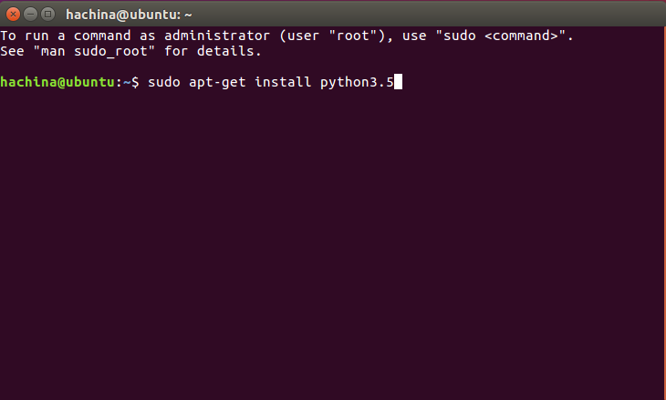
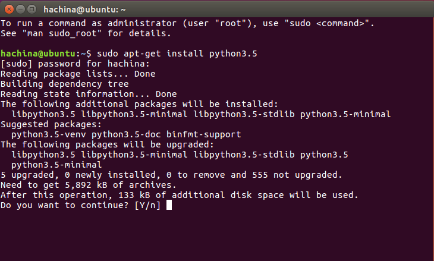
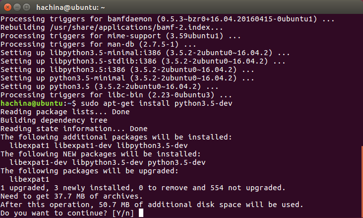
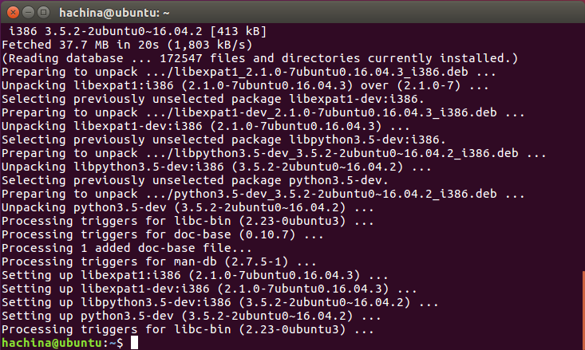
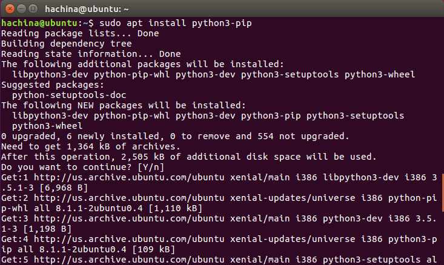
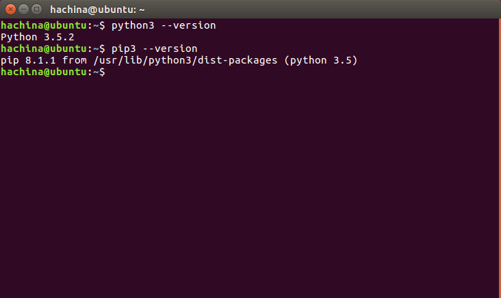
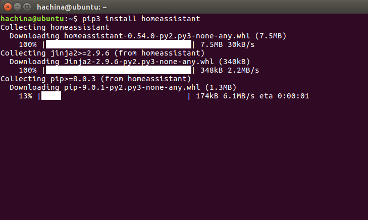
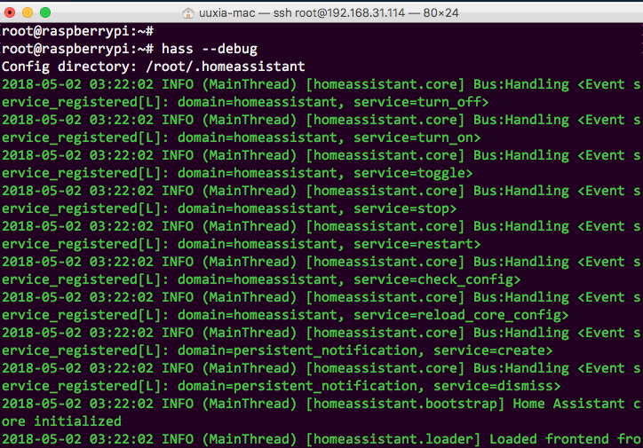
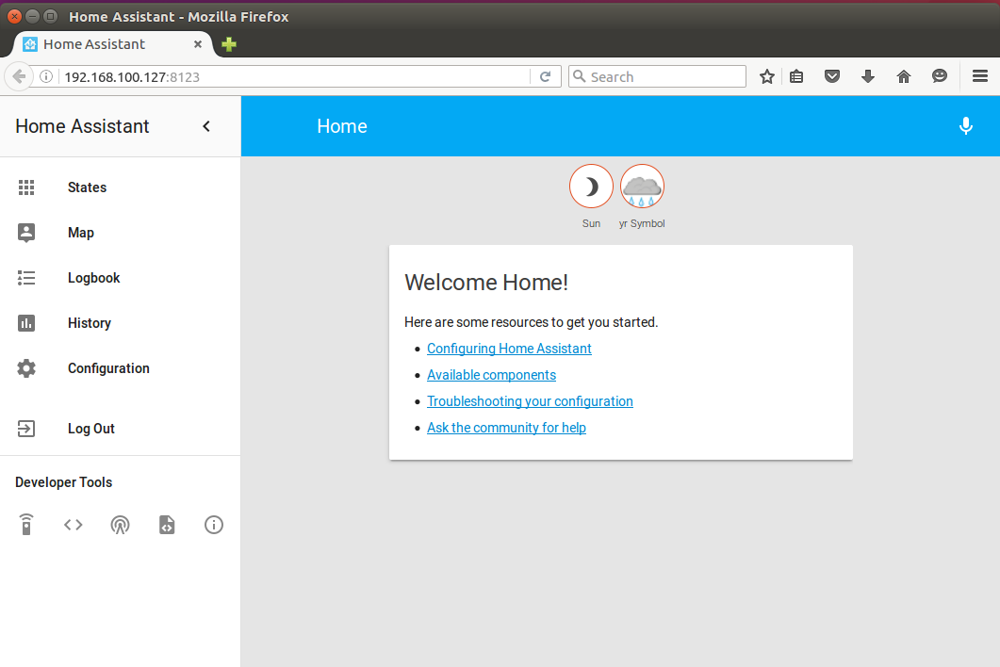

Home Assistant 是一款基于 Python 的智能家居开源系统，支持众多品牌的智能家居设备，可以轻松实现设备的语音控制、自动化等。本文档全站内容基于 Home Assistant 官方网站 本地化而成，具有以下特点：

整合『组件』与『文档』页，采用更直观清晰、符合中文阅读的展现形式；
剔除国内用户较少接触的组件说明，提高常用智能家居平台的层级和权重；
跳出 Home Assistant 原生框架，一并纳入 Floorplan、HADashboard 等相关衍生项目；
本文将讲述树莓派3B搭建HomeAssistant和小米设备的接入。
<!--more-->
# 一、系统要求和硬件配置
---
- 树莓派3B（Raspberry 3B）;
- 一张16G的TF存储卡；
- 一台电脑（windowns or mac）；
- 若干小米设备（小米网关、小米插座、小米吸顶灯等）；
- TF卡读卡器；
- 原生 [Raspbian](https://www.raspberrypi.org/downloads/raspbian/) 系统；
- xshell工具；
- [SDFormatter](http://www.upantool.com/hfxf/sd/3137.html)；
- [Win32 Disk Imager](http://www.onlinedown.net/soft/110173.htm)。
- [Etcher Mac版](http://www.pc6.com/mac/248733.html)（MacOs下烧录工具）；
- Fing工具（Android端或者ios端都行）。

# 二、系统安装
---
1. SDFormatter格式化TF存储卡
2. 使用Win32 Disk Imager工具烧录Raspbian系统到TF卡
3. 如果是在MacOs系统下，请用mac自带工具格式化TF卡，然后使用Etcher烧录系统；

# 三、树莓派配置
---
1. 烧录完毕后，TF卡自动命名为boot，**在boot根目录新建ssh文件以便ss登录**；
2. 在TF卡根目录新建`wpa_supplicant.conf`文件，用于连接WiFi，配置如下：

    ```

    country=CN
    ctrl_interface=DIR=/var/run/wpa_supplicant GROUP=netdev
    update_config=1
    network={
        ssid="路由器的ssid"
        psk="路由器的密码"
        key_mgmt=WPA-PSK
        priority=1
    }

    ```


3. 将TF卡插在树莓派后上电启动；
4. 使用Fing查询树莓派的IP地址；
5. 树莓派默认用户名**pi**，密码**raspberry**;
6. 使用xshell连接树莓派，MacOs方式：`ssh pi@192.168.x.x -p 22`；

## 3.1 启用root用户（由于本人天性爱自由，所以必须要绝对权限）
1. 设置root用户密码

>sudo passwd root

```

    pi@raspberrypi:~$ sudo passwd root
    Enter new UNIX password:   #输入第一遍密码
    Retype new UNIX password:  #输入第二遍密码
```
2. 启用 root 账号登录
>sudo passwd --unlock root


```

    pi@raspberrypi:~$ sudo passwd --unlock root
    passwd: password expiry information changed.
```
3. 设置root登陆

>sudo nano /etc/ssh/sshd_config  

```

    pi@raspberrypi:~$ sudo nano /etc/ssh/sshd_config    

```
    
>`Ctrl + W` 快捷键 搜索 `PermitRootLogin without-password`
>修改 `PermitRootLogin without-password` 为 `PermitRootLogin yes`
>执行完之后，用 `reboot` 命令重启，这样就可以解锁`root`账户。

# 四、HomeAssistant安装
---
## 4.1 源替换

由于默认都是从国外服务器下载安装，为了避免安装失败所以先替换成阿里的源。

- 在此目录新建此文件：` ~/.pip/pip.conf`

- 复制粘贴以下内容并保存：

```

    [global]
    trusted-host=mirrors.aliyun.com
    index-url=https://mirrors.aliyun.com/pypi/simple/

```


## 4.2 安装Python3

打开`Linux`系统命令行窗口，输入：`sudo apt-get install python3.5`

应系统要求输入`root`账号的密码。



安装资源准备好后提问是否继续安装，打回车确认。
然后等待安装完成。




## 4.3 安装Python3开发资源

在第一步安装完成后，继续输入命令：`sudo apt-get install python3.5-dev`
在系统提问是否继续安装时打回车确认。
然后等待安装完成。






## 4.4 安装Pip3
继续在命令行中输入：`sudo apt install python3-pip`
回车确认安装。
等待安装完成。




## 4.5 验证安装结果
在命令行中输入`python3 --version`，看到显示版本。
在命令行中输入`pip3 --version`，看到显示版本。
说明Python3环境及Pip3工具安装成功。




## 4.6 使用Pip工具安装Home Assistant
在此步之前建议设置国内的安装源，可以提升后续的速度，参见这篇文档。
打开命令行窗口，输入：`sudo pip3 install homeassistant` （<font color='red'>此步骤若失败，请重复操作</font>）
等待安装过程完成。





## 4.7 验证安装结果
在命令行窗口，输入：`hass --debug` 参数`--debug`可以查看启动的日志。
首次启动需要初始化配置文件，也会自动下载一些所需的文件，会需要一些时间。有时因网络质量问题还会出现文件下载失败情况，导致启动过程受阻。此时可以关闭命令行窗口，再重新执行启动命令。



继续等待启动过程完成，直到浏览器自动打开`Home Assistant`系统首页，即表明软件安装成功。




# 五、HomeAssistant设置自动启动
---

Home Assistant 针对树莓派的发行版（手动安装除外）中都已经自带自启任务，其余系统安装的用户需要自行配置自启。

## 5.1 配置自启动文件
如果你未使用 `Python` 虚拟环境安装 `Home Assistant`，请使用以下方法

    sudo nano -w /etc/systemd/system/home-assistant@root.service

复制粘贴

    [Unit]
    Description=Home Assistant
    After=network-online.target
    
    [Service]
    Type=simple
    User=%i
    ExecStart=/usr/local/bin/hass 
    
    [Install]
    WantedBy=multi-user.target


>注意`ExecStart=/usr/local/bin/hass`  这个路径使用`whereis hass`查看路径

## 5.2 启动自启服务

完成上述步骤后，请重新加载进程管理。

    sudo systemctl --system daemon-reload

启用服务：

    sudo systemctl enable home-assistant@root


# 六、HomeAssistant的一些常用命令
---

## 6.1 systemd相关的控制命令

    sudo systemctl --system daemon-reload：重新加载systemd的配置文件。
    sudo systemctl enable home-assistant@root：设置home-assitant服务为自启动。
    sudo systemctl disable home-assistant@root：从自启动中去除home-assitant服务。
    sudo systemctl start home-assistant@root：手工启动home-assitant服务（命令中start可以替换成stop、restart、status，完成停止、重启、查看服务状态等功能）。
    sudo journalctl -f -u home-assistant@root：查看hass的日志输出。
    sudo journalctl -f -u home-assistant@[your user] | grep -i 'error'：查看hass的日志输出中的error部分
    
    sudo systemctl restart home-assistant@root


## 6.2 使用脚本控制HomeAssistant

    #!/bin/bash
    
    function check()
    {
    	echo "检查配置文件是否有错误"
    	sudo hass --script check_config
    }
    
    function dis()
    {
    	echo "显示所有组件的配置信息"
    	sudo hass --script check_config --info all
    }
    
    function hass()
    {
    	echo "启动hass"
    	sudo systemctl start home-assistant@root
    }
    function rehass()
    {
    	echo "重启hass"
    	sudo systemctl restart home-assistant@root
    }
    
    function stophass()
    {
    	echo "停止hass"
    	sudo systemctl stop home-assistant@root
    }
    
    function log(){
    	echo "查看hass日志"
    	sudo journalctl -f -u home-assistant@root
    }
    
    function debug(){
    	echo "debug hass"
    	sudo hass --debug
    }
    
    
    
    echo "输入编号选择"
    echo "1. 检查配置文件是否有错误"
    echo "2. 显示所有组件的配置信息"
    echo "3. 启动hass"
    echo "4. 查看hass日志"
    echo "5. 重启hass"
    echo "6. 停止hass"
    echo "7. debug hass"
    echo "******Enter nothing to exit*****"
    read num
    
    case "$num" in
    [1] ) (check);;
    [2] ) (dis);;
    [3] ) (hass);;
    [4] ) (log);;
    [5] ) (rehass);;
    [6] ) (stophass);;
    [7] ) (debug);;
    *) echo "nothing,exit";;
    esac


# 七、小米设备接入
---
- 安装米家App（最新版本获取获取不到`Token`，使用【[MI Home5.0.19](http://uuxia.cn:8123/file/com.xiaomi.smarthome.apk)】此版本OK）;

- 使用[RE文件管理器](http://uuxia.cn:8123/file/RE.apk)，打开`/data/data/com.xiaomi.smarthome/databases/miio2.db`
- 记录设备的`token`
- [configuration.yaml](http://uuxia.cn:8123/file/configuration.yaml)配置文件

# 八、遇到的一些问题
---

1. urllib3与chardet不兼容解决方案


```

    pip3 uninstall urllib3
    pip3 uninstall  chardet
    ip3 install requests

```


2.执行sh ./xxx.sh出现：“Syntax error: “(” unexpected”的解决方法

    sudo dpkg-reconfigure dash
    在选择项中选No，搞定了！

3. nodejs安装

https://blog.csdn.net/xiongtm/article/details/77620005
https://nodejs.org/dist/latest-v9.x/

    


