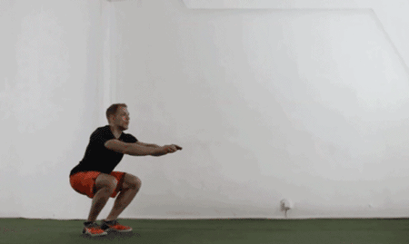
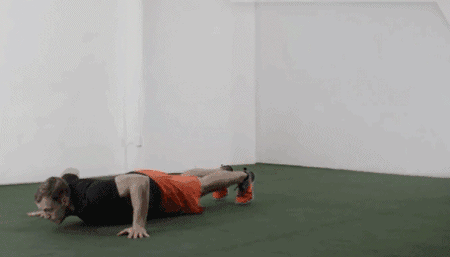
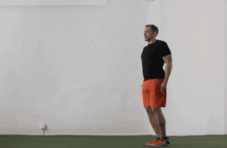
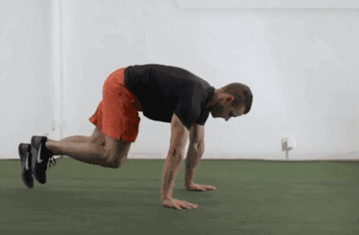
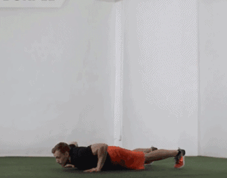

---
健身圈从来就是一个强者的舞台，有的人通过健身强健了体魄，有的人通过健身找到了自信。正所谓“一入健身深似海”，健身就是有这样的魔力让你欲罢不能。

<!--more-->
# 深蹲跳
---
锻炼部位：股四头肌、腘绳肌、臀大肌、腓肠肌。

# 俯卧撑
---
锻炼部位：胸大肌、肱三头肌。

# 开合跳
---
锻炼部位：股四头肌、三角肌、比目鱼肌、腓肠肌。

## 登山者
---
锻炼部位：股四头肌、腘绳肌、胸肌。

# 波比跳
---
锻炼部位：股四头肌、三角肌、腹直肌。

—贵在坚持—