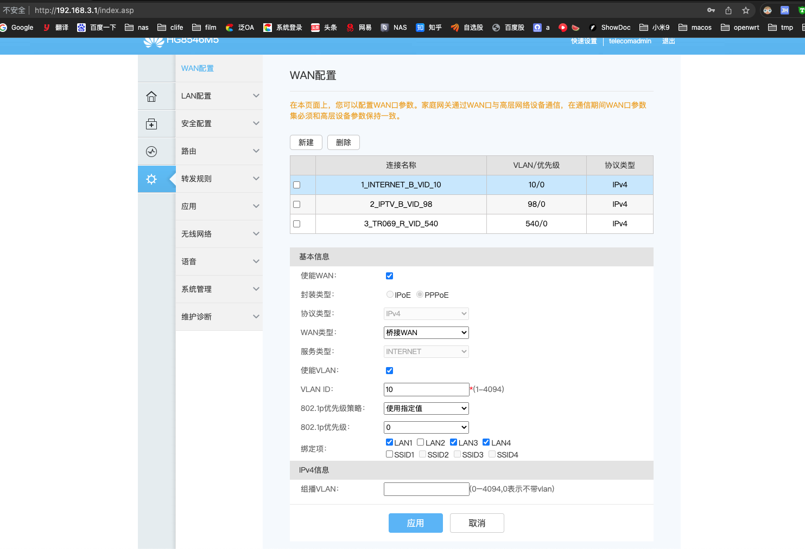
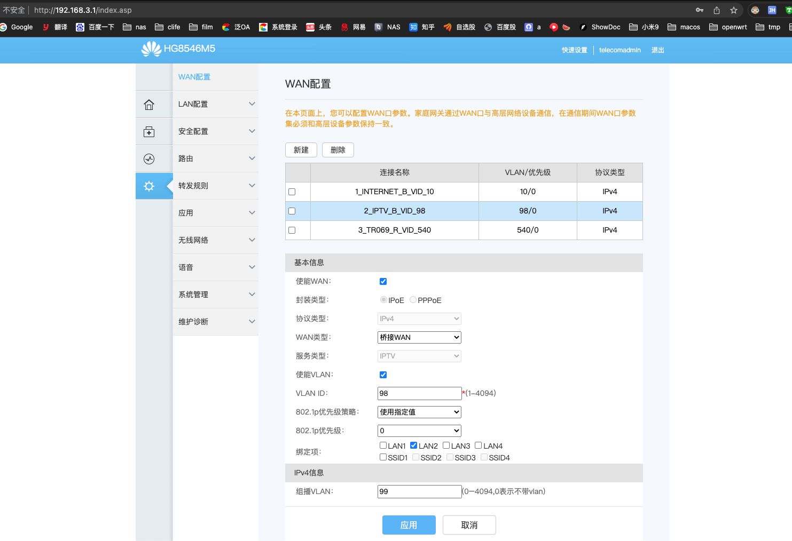
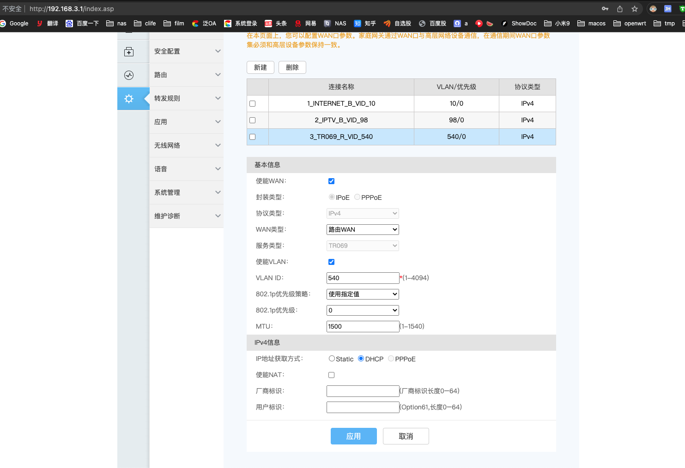

家庭光猫配置与IPV6设置，获取公网ipv6

检测地址
https://www.test-ipv6.com/  
你的公网 IPv6 地址是 XXXX 证明你已经可以IPv6上网了

<!--more-->

光猫登陆地址：http://192.168.3.1

请关闭电脑DHCP，手动设置IP

普通用户：root/adminHW
管理员 ：telecomadmin/admintelecom
宽带账户:202107592177，密码:096016

光猫备份文件

[光猫备份文件](mao-config/hw_ctree.xml "光猫备份文件")

[光猫配置文件](mao-config/config.txt "光猫配置文件")

#### 光猫桥接截图

